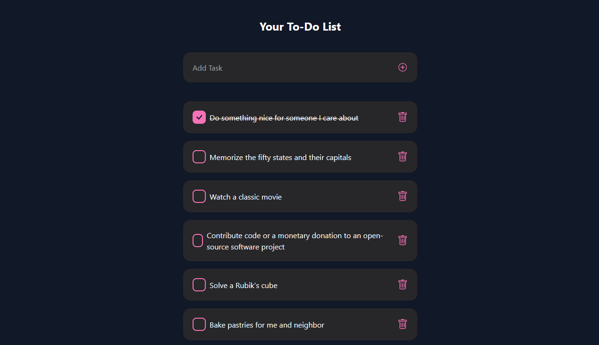

[![Contributors][contributors-shield]][contributors-url]
[![Forks][forks-shield]][forks-url]
[![Stargazers][stars-shield]][stars-url]
[![Issues][issues-shield]][issues-url]
[![MIT License][license-shield]][license-url]
[![LinkedIn][linkedin-shield]][linkedin-url]

<!-- PROJECT LOGO -->
 

  

<h3 align="center">To Do App</h3>

  

    Manage your To Do's
     
    <a href="https://artsiom-voitas.github.io/todo-app"><strong>View Demo</strong></a>
     
     
    <a href="https://github.com/artsiom-voitas/todo-app/issues">Report Bug</a>
    ·
    <a href="https://github.com/artsiom-voitas/todo-app/issues">Request Feature</a>
  

<!-- ABOUT THE PROJECT -->

## About The Project

  

This application is built with React. With it, you can:

-   add your own todos
-   mark todos as completed
-   remove todos

### Built With

-   [![React][React.js]][React-url]
-   [![Redux][Redux.js]][Redux-url]
-   [![TailwindCSS][tailwindcss.com]][tailwindcss-url]
-   [![Vite][vitejs.dev]][vitejs-url]

<!-- CONTACT -->

## Contact

Artsiom Voitas - [@artsiom_voitas](https://twitter.com/artsiom_voitas) - artsiom.voitas@gmail.com

Project Link: [https://github.com/artsiom-voitas/todo-app](https://github.com/artsiom-voitas/todo-app)

<!-- MARKDOWN LINKS & IMAGES -->
<!-- https://www.markdownguide.org/basic-syntax/#reference-style-links -->

[contributors-shield]: https://img.shields.io/github/contributors/artsiom-voitas/todo-app.svg?style=for-the-badge
[contributors-url]: https://github.com/artsiom-voitas/todo-app/graphs/contributors
[forks-shield]: https://img.shields.io/github/forks/artsiom-voitas/todo-app.svg?style=for-the-badge
[forks-url]: https://github.com/artsiom-voitas/todo-app/network/members
[stars-shield]: https://img.shields.io/github/stars/artsiom-voitas/todo-app.svg?style=for-the-badge
[stars-url]: https://github.com/artsiom-voitas/todo-app/stargazers
[issues-shield]: https://img.shields.io/github/issues/artsiom-voitas/todo-app.svg?style=for-the-badge
[issues-url]: https://github.com/artsiom-voitas/todo-app/issues
[license-shield]: https://img.shields.io/github/license/artsiom-voitas/todo-app.svg?style=for-the-badge
[license-url]: https://github.com/artsiom-voitas/todo-app/blob/master/LICENSE
[linkedin-shield]: https://img.shields.io/badge/-LinkedIn-black.svg?style=for-the-badge&logo=linkedin&colorB=555
[linkedin-url]: https://www.linkedin.com/in/artsiom-voitas/
[React.js]: https://img.shields.io/badge/React-20232A?style=for-the-badge&logo=react&logoColor=61DAFB
[React-url]: https://react.dev/
[Redux.js]: https://img.shields.io/badge/Redux-593D88?style=for-the-badge&logo=redux&logoColor=white
[Redux-url]: https://redux.js.org/
[tailwindcss.com]: https://img.shields.io/badge/Tailwind_CSS-38B2AC?style=for-the-badge&logo=tailwind-css&logoColor=white
[tailwindcss-url]: https://tailwindcss.com/
[vitejs.dev]: https://img.shields.io/badge/vite-%23646CFF.svg?style=for-the-badge&logo=vite&logoColor=white
[vitejs-url]: https://vitejs.dev/
